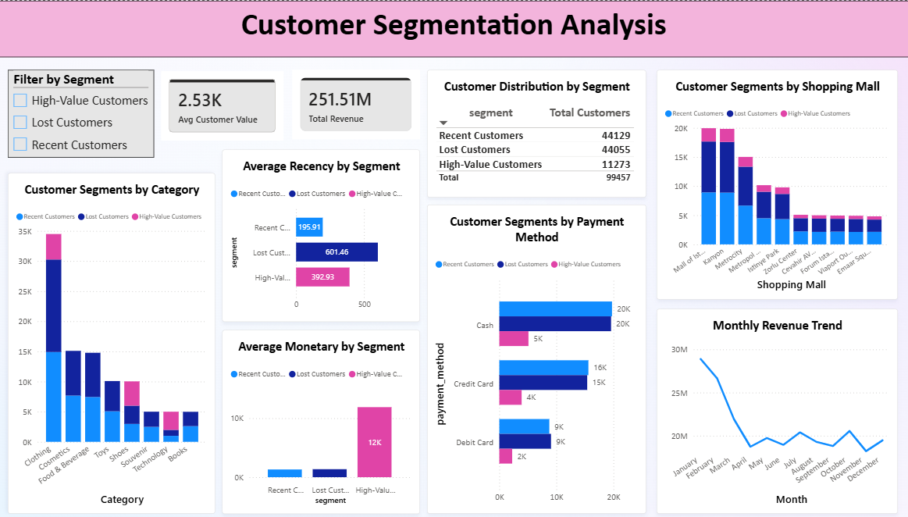

# Customer Segmentation Analysis

An end-to-end data analysis project focused on understanding customer purchasing behaviour, identifying customer segments using RFM Analysis and K-Means Clustering, and generating business insights through an interactive Power BI dashboard.

## Project Overview

The objective of this project is to analyse customer purchasing behaviour, identify meaningful customer segments, and generate insights that can support customer retention and business decision-making.

- Tools & Technologies
- Python
- Jupyter Notebook
- Pandas
- PostgreSQL
- Power BI
- RFM Analysis
- K-Means Clustering

## Project Workflow
```text
Dataset
   ↓
Data Preparation & Analysis
(Python / Jupyter Notebook)
   ↓
RFM Table Creation
   ↓
RFM Analysis
   ↓
Frequency Evaluation
   ↓
K-Means Clustering
   ↓
Customer Segmentation
   ↓
PostgreSQL
   ↓
Power BI Dashboard
   ↓
Business Insights
```


## RFM Analysis & Customer Segmentation

First, an RFM table was created using Recency, Frequency, and Monetary values for each customer.

After analysing the RFM data, it was observed that Frequency had a value of 1 for every customer. Since it showed no variation and was not contributing to the clustering process, Frequency was dropped before applying K-Means Clustering.

The final clustering was therefore based on:

- Recency — how recently a customer made a purchase
- Monetary — the customer's total spending

### The final customer segments are:

- High-Value Customers — customers with high monetary value.
- Recent Customers — customers with relatively recent purchases.
- Lost Customers — customers with high recency and lower monetary value.

## Power BI Dashboard

### The dashboard provides analysis of:

- Customer distribution by segment
- Revenue by category and segment
- Average recency by segment
- Average monetary value by segment
- Revenue by shopping mall and segment
- Customers segments by payment method
- Monthly revenue trends
- Segment-based filtering

## Key Insights
- Total Customers: 99,457
- Total Revenue: 251.51M
- High-Value Customers: 11,273
- Recent Customers: 44,129
- Lost Customers: 44,055
- Clothing generated the highest category revenue at approximately 114M.
- Kanyon and Mall of Istanbul generated approximately 51M each.
- Cash was the most commonly used payment method.
- Monthly revenue was highest in January and declined until April–May, followed by fluctuations during the remaining months.

## Project Structure
```text
Customer-Segmentation-Analysis/
│
├── Dataset/
│   └── customer_shopping_data.csv
│
├── Dashboard/
│   ├── customer_segmentation_dashboard.png
│   ├── dashboard_with_one_filter.png
│   └── dashboard_with_multiple_filters_using_ctrl.png
│
├── Insights/
│   └── Customer_Segmentation_Analysis-Insights.pdf
│
├── Notebook/
│   └── customer_segmentation_analysis.ipynb
│
├── PowerBI/
│   └── customer_segmentation_analysis.pbix
│
├── SQL/
│   └── customer_segmentation_analysis.sql
│
├── .gitignore
└── Readme.md
```

## Project Files
- Dataset — Dataset used for the analysis
- Dashboard — Power BI dashboard screenshots
- Insights — Business insights and suggestions
- Notebook — Data preparation, RFM analysis and K-Means clustering
- PowerBI — Power BI dashboard file
- SQL — SQL queries covering customer analysis
##Outcome

This project demonstrates an end-to-end data analysis workflow, from data preparation and customer segmentation to database integration, dashboard development, and business insight generation.

### Dashboard Preview


